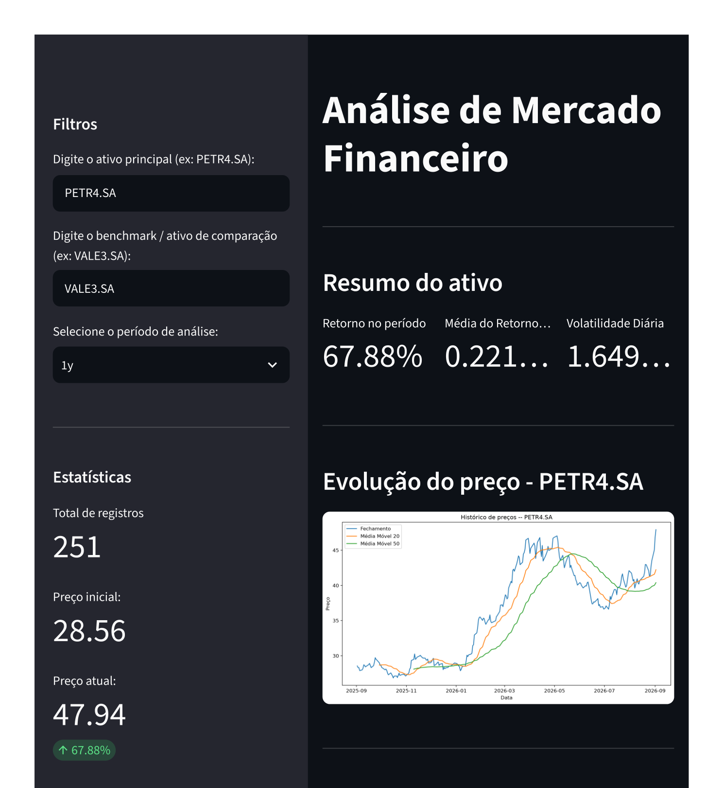
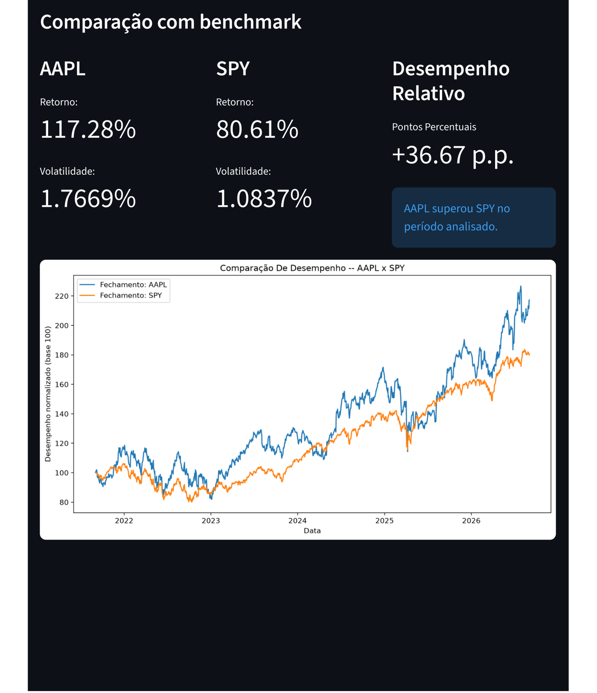

# 📈 Análise de Mercado Financeiro

Dashboard desenvolvido em Python para análise de ativos financeiros e comparação de desempenho com benchmarks utilizando dados reais de mercado.

🔗 **Demo online:** https://market-analysis-dashboard.streamlit.app/



## Sobre o projeto

A aplicação permite selecionar um ativo, período de análise e benchmark para acompanhar indicadores de retorno, risco e tendência.

Os dados são obtidos através do Yahoo Finance e processados com Pandas. A interface foi desenvolvida com Streamlit e as visualizações com Matplotlib.

## Funcionalidades

- Consulta de dados históricos de ativos
- Seleção de ativo, benchmark e período
- Cálculo de retorno no período
- Retorno diário médio
- Volatilidade diária
- Médias móveis de 20 e 50 períodos
- Comparação de desempenho entre ativo e benchmark
- Normalização das séries para base 100
- Desempenho relativo em pontos percentuais
- Validação de ativos sem dados e entradas inválidas

## Comparação com benchmark

Além da análise individual do ativo, o dashboard permite comparar retorno e volatilidade com outro ativo utilizado como benchmark.

As séries são normalizadas para uma mesma base, permitindo comparar sua evolução independentemente da diferença entre os preços nominais.



## Tecnologias

- Python
- Pandas
- yfinance
- Matplotlib
- Streamlit
- Git e GitHub

## Estrutura do projeto

```text
analise-mercado-financeiro/
├── app.py
├── src/
│   ├── data.py
│   ├── analysis.py
│   └── charts.py
├── images/
│   ├── dashboard-overview.png
│   └── benchmark-comparison.png
├── requirements.txt
└── README.md
```

A aplicação foi organizada separando responsabilidades:

- `data.py` — coleta e preparação dos dados
- `analysis.py` — cálculos e indicadores
- `charts.py` — visualizações
- `app.py` — interface e integração dos módulos

## Como executar

Clone o repositório:

```bash
git clone https://github.com/murilloalvz/analise-mercado-financeiro.git
cd analise-mercado-financeiro
```

Crie e ative um ambiente virtual:

```bash
python -m venv venv
```

Windows:

```bash
.\venv\Scripts\activate
```

Linux/macOS:

```bash
source venv/bin/activate
```

Instale as dependências e execute:

```bash
pip install -r requirements.txt
streamlit run app.py
```

## Exemplos de ativos

A aplicação pode analisar tickers disponíveis no Yahoo Finance, como:

`PETR4.SA` • `VALE3.SA` • `BOVA11.SA` • `AAPL` • `MSFT` • `NVDA` • `SPY`

## O que desenvolvi neste projeto

Durante o desenvolvimento, trabalhei principalmente com:

- manipulação de DataFrames e séries temporais;
- consumo e tratamento de dados externos;
- cálculo de indicadores financeiros;
- normalização e comparação de séries;
- visualização de dados;
- tratamento de entradas e casos extremos;
- organização modular de uma aplicação Python;
- versionamento com Git e GitHub.

## Status

**v1.0 concluída e publicada.**

O projeto possui coleta de dados, análise de retorno e risco, médias móveis, comparação com benchmark, interface interativa e deploy público.

---

**Murillo Lourenço**  
Análise e Desenvolvimento de Sistemas — FATEC Sorocaba